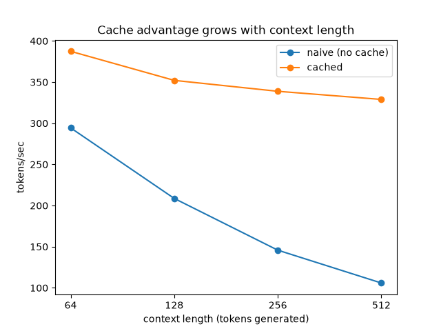

# llmcore

A char-level GPT and the inference stack on top of it: a KV cache, temperature/top-k/top-p sampling,
and int8 KV-cache quantization.

The transformer is scaffolding. What I wanted was a system small enough that I could measure claims
people usually repeat without checking. Three of them turned out to be worth checking.

## 1. Caching removes a factor of T. It does not make decoding O(1) per step.

The usual framing is that KV caching takes generation from O(T²) to O(T), which makes it sound like
per-step cost becomes constant. It doesn't. A cached decode step still projects one token
(`O(n_embd²)`) and then scans the entire cache (`O(T · head_size)` per head). Only the first term is
constant. The second grows with context, so cached throughput decays too, just more slowly.

The shipped model's `block_size=64` is far too short to see any of this, so
`llmcore/experiments.py` sweeps untrained models at larger context sizes (timing doesn't depend on
the weights):



| context | naive tok/s | cached tok/s | speedup |
|---:|---:|---:|---:|
| 64  | 294.4 | 387.5 | 1.32x |
| 128 | 208.7 | 352.1 | 1.69x |
| 256 | 145.8 | 338.9 | 2.32x |
| 512 | 105.9 | 329.0 | 3.11x |

Over an 8x increase in context, naive throughput falls 2.8x and cached falls 1.18x. The ratio
between those decay rates is the factor caching buys you, and at 512 tokens it's still climbing.

The cached curve's slight bend is the scan term arriving on schedule. Per layer per step,
projections cost about `4 · n_embd²` and attention costs `t · n_embd`, so they cross at
`t ≈ 4 · n_embd`, which is 512 for this model. That's where the line starts visibly sagging.

## 2. A cache bug moves the output distribution ~900x more than int8 does, and neither one crashes

This is why `tests/test_cache_equiv.py` asserts *token-identical* output rather than approximate
agreement. I deliberately broke the position accounting (left the positional-embedding offset at 0,
the "forgot the cache exists" mistake) and decoded one step:

| variant | max logit drift | total variation | top-1 token |
|---|---:|---:|---|
| offset left at 0 (bug) | 3.6424 | 0.5485 | changed |
| int8 round trip | 0.0078 | 0.0006 | unchanged |

The bug relocated 55% of the probability mass and picked a different token. It raised no exception,
produced no NaN, and returned correctly-shaped tensors. Nothing about running it would tell you it
was wrong. Meanwhile the optimization I'd actually expect to hurt (int8) moved the distribution by
0.0006.

The thing that prevents this class of bug in the first place is refusing to branch on cache state.
`Head` slices its causal mask by absolute position:

```python
T_cached = k.shape[1] - q.shape[1]
causal_mask = self.mask[T_cached : T_cached + T_new, :T_total]
```

One expression covers all three cases. No cache reduces to the original `[:T, :T]`. Single-token
decode yields a row of ones, which is right because a new token may see its whole history. Prefill
gets ordinary causal masking among the new tokens. `GPT.forward` derives the position offset from
`past_kv`'s own shape rather than tracking it separately, so there is no second source of truth to
disagree with.

## 3. int8 costs 3.2x memory, not 4x, and buys it for +0.02% perplexity

Both halves of this tradeoff usually get quoted separately or not at all. The memory side first:


The advertised number is 4x versus fp32. Real is 3.2x, because `scale` and `zero_point` stay float32
and cost a fixed 8 bytes per group regardless of group size. Sweeping group size from 8 to 2048, the
ratio tracks `(group_size * 4) / (group_size + 8)` exactly, approaching 4x and never arriving. At
this model's `head_size=32` that's 3.2x.

The quality side, over 200 prefill-and-decode trials on held-out text:

```
max |logit drift|:     mean 0.01473, worst 0.15311
top-1 token unchanged: 200/200 = 100.0%
perplexity:            fp32 20.095 -> int8 20.100  (+0.02%)
```

So the trade is 3.2x memory for two hundredths of a percent of perplexity and, across 200 trials,
not one changed token. That's the sentence I wanted and couldn't write before measuring it.

## Reproducing

```bash
python -m venv .venv && . .venv/bin/activate    # .venv\Scripts\activate on Windows
pip install -r requirements.txt
python scripts/download_data.py                 # TinyShakespeare
python -m pytest tests/ --ignore=tests/test_training.py   # 22 tests
python -m llmcore.bench                         # shipped-config benchmarks
python -m llmcore.experiments                   # the three findings above
```

`experiments.py` is sensitive to competing load. An earlier version of the scaling sweep ran
alongside another job and produced a non-monotonic curve; the run above uses a median of 5 repeats
on an otherwise idle machine.

## The model

Char-level, `n_embd=128`, `n_head=4`, `n_layer=4`, `block_size=64`, 4000 steps on TinyShakespeare.


It produces recognizable words and reproduces the script formatting (all-caps speaker names on their
own line) without reaching coherent English, which is what this size buys.

## Layout

```
llmcore/
  model.py        # Head -> MultiHeadAttention -> Block -> GPT, all cache-transparent
  generate.py     # generate_naive (reference) vs generate_cached, plus sample_next
  quantize.py     # per-token affine int8, grouping tradeoff in the docstring
  bench.py        # shipped-config numbers, measured not projected
  experiments.py  # the three findings above
  train.py        # AdamW loop
  tokenizer.py    # char-level, vocab is the corpus's unique characters
  data.py         # random windows, targets shifted by one
tests/            # shapes, causality, cache equivalence, sampling, quantization
DEVLOG.md         # dated build log with the bugs left in
```

`DEVLOG.md` is the unedited version, including the backward-before-forward crash, the softmax
normalizing over the wrong axis, and the `sample_kwargs` that were silently discarded and made the
cache look broken when it wasn't.

## Limitations

`generate_cached` can't exceed `block_size` tokens. Positional embeddings are a fixed lookup table
and the cached path never forgets anything, so it runs off the end of that table. `generate_naive`
sidesteps this by silently cropping old context every step. Rotary embeddings or sliding-window
eviction would fix it; I built neither.

Quantization is measured but not deployed. Finding 3 quantizes a real cache and measures what it
costs, but the live decode path in `generate_cached` doesn't call `quantize_int8`. Wiring it in
means storing quantized K/V and dequantizing before the attention matmul, which is the next thing.
