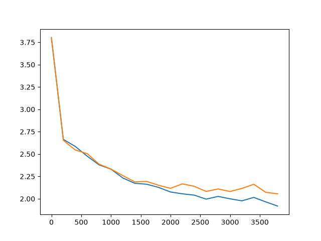
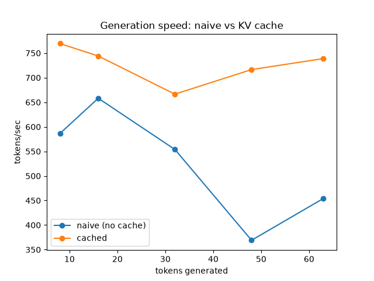
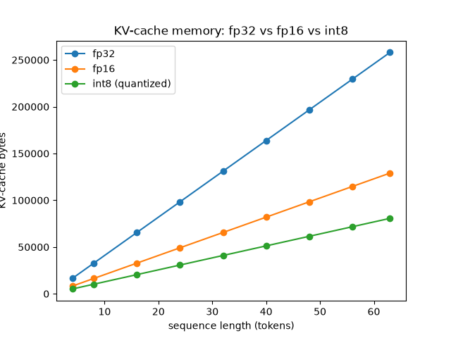

# llmcore

A small, from-scratch LLM inference engine. A decoder-only transformer implemented
in PyTorch, plus the inference stack that makes generation fast and cheap: a KV
cache, tunable sampling, and an int8-quantized KV cache — each one measured, not
asserted.

The model is the easy half. The point of this repo is the **systems layer on top of
it**: how you go from a correct forward pass to fast, memory-efficient token
generation, and how you *prove* each optimization is both faster and still correct.

## Why it exists

Autoregressive generation recomputes attention over the whole prefix at every step
unless you cache it. Caching trades memory for speed; quantizing the cache trades a
little accuracy for a lot of memory. This repo builds that stack from zero and
benchmarks every rung:

- **Correctness** — the KV-cache path must produce *token-identical* output to the
  full-recompute path (`tests/test_cache_equiv.py`). An optimization that changes the
  answer isn't an optimization.
- **Speed** — tokens/sec, cached vs. uncached (`llmcore/bench.py`).
- **Memory** — measured KV-cache bytes, fp16 vs. int8.

## Layout

```
llmcore/
  tokenizer.py   # text <-> token ids
  data.py        # corpus -> batched (x, y) tensors
  model.py       # Head -> MultiHeadAttention -> Block -> GPT
  train.py       # training loop, checkpointing
  generate.py    # sampling + the KV cache (the payoff)
  quantize.py    # int8 KV cache + memory measurement
  bench.py       # tokens/sec + memory benchmarks, plots
tests/           # shape, causality, cache-equivalence, sampling, quantization tests
scripts/         # data download
plots/           # committed benchmark output (see Results)
DEVLOG.md        # daily build log — read this to see how it was actually built
```

### Per-module notes

- **`tokenizer.py`** — char-level `CharTokenizer`: vocab is just the sorted set of unique characters in the corpus, so it's language-agnostic (see `data.py`'s docstring on swapping corpora).
- **`data.py`** — `get_batch` samples random windows and shifts by one for next-token targets. `load_tokens`/`train_val_split` are corpus-agnostic; nothing here is Shakespeare-specific.
- **`model.py`** — `Head`'s causal mask uses an *absolute-position* slice (`self.mask[T_cached:T_cached+T_new, :T_total]`) so the same formula handles no-cache, prefill, and cached decode without branching — the key insight that makes `Head`/`MultiHeadAttention`/`Block`/`GPT.forward` all cache-transparent. `GPT` derives the KV-cache position offset from `past_kv`'s own shape rather than a separately-tracked argument, so it can't drift out of sync.
- **`train.py`** — standard AdamW loop; `estimate_loss` always restores `model.train()` before returning, even though it evaluates in `.eval()` mode.
- **`generate.py`** — `generate_naive` is the deliberately-slow correctness reference (recomputes everything every step); `generate_cached` prefills once then decodes one token at a time, feeding *only* the newest token each step (see Day 8 devlog on why the whole growing sequence must never be re-fed once caching is in play). `sample_next` composes temperature, top-k, and top-p filtering before the final multinomial draw.
- **`quantize.py`** — per-token affine int8 quantization (`quantize_int8`/`dequantize_int8`); grouping axis and its accuracy/memory tradeoff vs. per-channel grouping are documented in the module docstring. Not yet wired into live generation — see [Known limitations](#known-limitations).
- **`bench.py`** — every number here is *measured*, not projected: real wall-clock timing (warmup + median of repeats) and real tensor byte counts, not theoretical estimates.

## Build plan (one concept per commit)

Each box is one day / one commit. The commit message says what broke and why the fix works.

- [x] **1 — data in.** Tokenizer (char-level to start) + batched data loader. Overfit-able tiny corpus.
- [x] **2 — one attention head.** Q/K/V, scaled dot-product, causal mask. Understand why the mask and why √d.
- [x] **3 — multi-head attention.** Split into heads, attend, concat, project.
- [x] **4 — a transformer block.** FeedForward + residual + pre-LayerNorm.
- [x] **5 — the full GPT.** Token + positional embeddings, stacked blocks, LM head, weight tying.
- [x] **6 — training loop.** AdamW + LR warmup. Overfit a single batch to loss ≈ 0 (proves backprop).
- [x] **7 — real run.** Train on the corpus; sample coherent text. Save loss curve.
- [x] **8 — KV cache.** Cache K/V during generation. Cached vs. recompute; measure the speedup.
- [x] **9 — sampling.** Temperature, top-k, top-p.
- [x] **10 — int8 KV cache.** Quantize the cache; measure the memory drop.
- [x] **11 — benchmarks.** tokens/sec + KV bytes, fp16 vs int8, with plots in the README.
- [x] **12 — tests + polish.** Shape tests, cache-equivalence test, per-module writeup.

## Setup

```bash
python -m venv .venv && . .venv/bin/activate    # or .venv\Scripts\activate on Windows
pip install -r requirements.txt
python scripts/download_data.py                 # TinyShakespeare
```

## Results

All numbers below are measured on the actual trained checkpoint (`n_embd=128, n_head=4,
n_layer=4, block_size=64`, TinyShakespeare, 4000 training steps) — not projected.
Reproduce with `python -m llmcore.bench` from the repo root.

### Training loss



### Generation speed: naive vs. KV cache



| tokens generated | naive tok/s | cached tok/s | speedup |
|---:|---:|---:|---:|
| 8  | 586.3 | 769.4 | 1.31x |
| 16 | 658.1 | 744.1 | 1.13x |
| 32 | 553.9 | 666.5 | 1.20x |
| 48 | 369.1 | 716.5 | 1.94x |
| 63 | 454.2 | 738.9 | 1.63x |

Swept up to `block_size=64` — `generate_cached` can't exceed that (see
[Known limitations](#known-limitations)). An earlier informal, single-run check (no
warmup, no repeats) showed cached *losing*; that was measurement noise, not a real
result — see the Day 8 and Day 11 devlog entries for the full story on why a proper
benchmark methodology (warmup + median-of-repeats) matters.

### KV-cache memory: fp32 vs. fp16 vs. int8



At this model's `head_size=32`: **int8 is ~3.2x smaller than fp32, ~1.6x smaller than
fp16** — a constant ratio at every sequence length, since the per-token quantization
overhead (one `scale` + `zero_point` per token) doesn't grow with sequence length. Not
the naive "int8 = 4x" — see the Day 10 devlog for the `(group_size×4)/(group_size+8)`
formula this follows and why smaller groups dilute the savings.

## Known limitations

Written down honestly rather than glossed over — both are real properties of this
implementation, not bugs, and both are exactly the kind of thing a production system
has to solve that this toy-scale project didn't need to:

- **`generate_cached` can't exceed `block_size` tokens.** Positional embeddings are a
  fixed-size lookup table (`nn.Embedding(block_size, n_embd)`); `generate_naive` avoids
  this by silently cropping old context every step, but `generate_cached` is built to
  *never* forget anything, so it has nowhere to go once the position offset exceeds
  `block_size`. Real systems solve this with relative/rotary position encodings (RoPE)
  or a sliding-window cache eviction policy — out of scope here.
- **Quantization is measured but not deployed.** `quantize.py` is fully correct and
  tested in isolation (round-trip error, memory savings), and `bench.py` uses it to
  *measure* what a quantized cache would cost — but nothing in `generate_cached`'s
  actual decode path calls `quantize_int8`/`dequantize_int8`. Wiring it in (store
  quantized, dequantize just before the attention matmul) and measuring the resulting
  perplexity/accuracy impact is the natural next step, not yet done.
